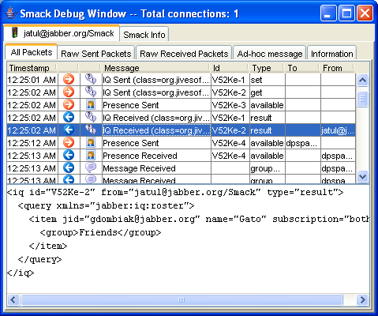
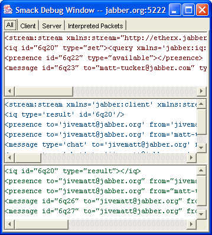

Debugging with Smack
====================

[Back](index.html)

Smack includes two built-in debugging consoles that will let you track all XML
traffic between the client and server. A lite debugger which is part of the
`smack-core.jar` and an enhanced debugger contained in `smack-debug.jar`.

Debugging mode can be enabled in two different ways:

  1. Add the following line of code **before** creating new connections:

`XMPPConnection.DEBUG_ENABLED = true;`

  2. Set the Java system property `smack.debugEnabled` to true. The system property can be set on the command line such as:

`java -Dsmack.debugEnabled=true SomeApp `

If you wish to explicitly disable debug mode in your application, including
using the command-line parameter, add the following line to your application
before opening new connections:

`XMPPConnection.DEBUG_ENABLED = false;`

Smack uses the following logic to decide the debugger console to use:

  1. It will first try use the debugger class specified in the Java system property `smack.debuggerClass`. If you need to develop your own debugger, implement the `SmackDebugger` interface and then set the system property on the command line such as:

`java -Dsmack.debuggerClass=my.company.com.MyDebugger SomeApp `

  2. If step 1 fails then Smack will try to use the enhanced debugger. The file `smackx-debug.jar` contains the enhanced debugger. Therefore you will need to place the jar file in the classpath. For situations where space is an issue you may want to only deploy `smack-core.jar` in which case the enhanced debugger won't be available.

  3. The last option if the previous two steps fail is to use the lite debugger. The lite debugger is a very good option for situations where you need to have low memory footprint.

Enhanced Debugger
-----------------

 When debugging mode is
enabled, a debug window will appear containing tabs for each new created
connection. The window will contain the following information:

  * XMPPConnection tabs -- each tab shows debugging information related to the connection.
  * Smack info tab -- shows information about Smack (e.g. Smack version, installed components, etc.).  The connection tab will contain the following information:
  * All Packets -- shows sent and received packets information parsed by Smack.
  * Raw Sent Packets -- raw XML traffic generated by Smack and sent to the server.
  * Raw Received Packets -- raw XML traffic sent by the server to the client.
  * Ad-hoc message -- allows to send ad-hoc packets of any type.
  * Information -- shows connection state and statistics.

Lite Debugger
-------------

 When debugging mode is enabled, a
debug window will appear when each new connection is created. The window will
contain the following information:

  * Client Traffic (red text) -- raw XML traffic generated by Smack and sent to the server.
  * Server Traffic (blue text) -- raw XML traffic sent by the server to the client.
  * Interpreted Packets (green text) -- shows XML packets from the server as parsed by Smack.  Right click on any of the panes to bring up a menu with the choices to copy of the contents to the system clipboard or to clear the contents of the pane.

Copyright (C) Jive Software 2002-2008
